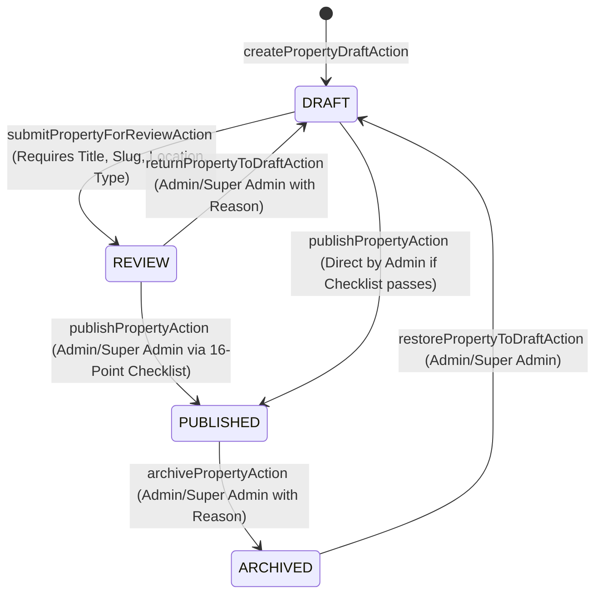

# Ratiwal Dream Estates — Property Management & CRUD System (PRD 4)

## 1. Executive Summary

This document describes the architecture, data models, state machine, Server Actions, inventory subsystem, audit logging, and concurrency controls powering the **Ratiwal Dream Estates Dashboard Property Management System**.

---

## 2. Architecture & Directory Structure

```
src/
├── app/
│   └── dashboard/
│       ├── properties/
│       │   ├── page.tsx                             # Property Catalog Table with Filters & Quick Actions
│       │   ├── new/                                 # Fast 4-Field Draft Creation Route
│       │   │   ├── page.tsx
│       │   │   └── loading.tsx
│       │   └── [propertyId]/
│       │       ├── edit/                            # Master 11-Section Property Editor Route
│       │       │   ├── page.tsx
│       │       │   └── loading.tsx
│       │       ├── inventory/                       # Dedicated Plot Inventory Management Route
│       │       │   ├── page.tsx
│       │       │   └── loading.tsx
│       │       └── preview/                         # Protected Real-Time Live Preview Route
│       │           ├── page.tsx
│       │           └── loading.tsx
├── components/
│   └── dashboard/
│       ├── properties/
│       │   ├── PropertyTable.tsx                    # Enhanced Table with Actions, Statuses, Archive Modal
│       │   ├── PropertyFilters.tsx                  # Search & Type/Status/Corridor Filters
│       │   ├── NewPropertyForm.tsx                  # Client Draft Form with Realtime Slug Check
│       │   └── editor/
│       │       ├── PropertyEditor.tsx               # Master Multi-Section Editor Controller
│       │       └── sections/                        # 11 Modular Form Sections & Modals
│       └── inventory/
│           └── InventoryManager.tsx                 # Plot Grid, KPI Cards, Filters, Add/Edit Modals
├── lib/
│   ├── actions/
│   │   ├── property.actions.ts                      # Server Actions for Lifecycle & Properties
│   │   ├── inventory.actions.ts                     # Server Actions for Plot Inventory CRUD
│   │   └── types.ts                                 # Standard ActionResult<T> Envelope
│   ├── services/
│   │   ├── property-editor.service.ts               # 16-Point Publishing Checklist & Editor Queries
│   │   └── audit.service.ts                         # Safe Append-Only Audit Logging Service
│   └── validations/
│       └── property.schema.ts                       # Zod Validation Schemas for Forms & Actions
└── models/
    └── AuditLog.ts                                  # Append-Only Audit Log Mongoose Model
```

---

## 3. Role-Based Access Control (RBAC)

| Role | Create Draft | Edit Draft / Review | Manage Inventory & Media | Submit for Review | Return to Draft | Publish Property | Archive Property | Restore Archived | Change Published Slug |
|---|---|---|---|---|---|---|---|---|---|
| **EDITOR** | ✅ | ✅ | ✅ | ✅ | ❌ | ❌ | ❌ | ❌ | ❌ |
| **ADMIN** | ✅ | ✅ | ✅ | ✅ | ✅ (with reason) | ✅ (passes checklist) | ✅ (with reason) | ✅ | ❌ |
| **SUPER_ADMIN** | ✅ | ✅ | ✅ | ✅ | ✅ (with reason) | ✅ (passes checklist) | ✅ (with reason) | ✅ | ✅ (with justification) |

---

## 4. Property Lifecycle State Machine



---

## 5. 16-Point Publishing Pre-Flight Checklist

Before any property can transition into `PUBLISHED` status, `validatePublishingChecklist(propertyId)` evaluates the following 16 mandatory and advisory checks:

1. **Title & Unique Slug:** Title $\ge$ 5 chars; slug formatted and non-colliding.
2. **Active Growth Corridor:** Target Location exists and is not archived.
3. **Descriptions:** Short overview ($\ge 10$ chars) and editorial description.
4. **Area Range:** Canonical sq ft range strictly defined ($A_{\min} \le A_{\max}$).
5. **Pricing Transparency:** Pricing type, base rates, and visibility configured.
6. **Primary Hero Image:** Exactly 1 primary image designated with valid URL.
7. **Media Assets:** At least 3 gallery assets recommended.
8. **RERA Compliance:** Valid registration number verified or formally marked exempt.
9. **Legal Documents:** Title deeds or masterplan layout documents attached.
10. **Key Highlights:** Bullet highlights provided for buyers.
11. **Infrastructure Milestones:** Nearby connectivity and civic development milestones.
12. **Connectivity Timings:** Realistic travel times to airport/highways.
13. **Zoning & Classification:** Correct residential/commercial/farm land zoning.
14. **Plot Inventory Consistency:** If plots exist, at least 1 active inventory option configured.
15. **SEO & Social Meta:** Title and meta description populated for search engines.
16. **No Stale Conflicts:** Matches expected Mongoose document version (`__v`).

---

## 6. Optimistic Concurrency Control

To prevent race conditions when multiple administrators edit a property simultaneously:
- Each edit form loads the document's Mongoose version `__v` as `expectedVersion`.
- Server Actions enforce:
  ```ts
  if (expectedVersion !== undefined && property.__v !== expectedVersion) {
    return {
      success: false,
      code: "CONFLICT",
      message: "This property was modified by another administrator. Please refresh.",
    };
  }
  ```
- When a conflict occurs, the Property Editor triggers a **Concurrency Conflict Modal** offering the user the option to reload the latest database state without silent data overwrite.

---

## 7. Append-Only Audit Logging

Every mutating action generates an immutable audit record in the `AuditLog` collection:
- **Timestamp & Actor:** Email, Role, IP address, User Agent.
- **Action Type:** `PROPERTY_CREATED`, `PROPERTY_UPDATED`, `PROPERTY_SUBMITTED_FOR_REVIEW`, `PROPERTY_RETURNED_TO_DRAFT`, `PROPERTY_PUBLISHED`, `PROPERTY_ARCHIVED`, `PROPERTY_RESTORED`, `PUBLISHED_SLUG_CHANGED`, `PLOT_CREATED`, `PLOT_UPDATED`, `PLOT_STATUS_CHANGED`.
- **Target References:** `targetPropertyId`, `targetLocationId`, `targetPlotId`.
- **Audit Changes:** `field`, `from`, `to`, `reason`.

---

## 8. Verification & Test Suite

Run the full automated test battery:
```bash
npm run test:foundation  # 31 passed
npm run test:models      # 41 passed
npm run test:dashboard   # 19 passed
npm run test:crud        # 19 passed
```
All 110 automated tests pass with 0 failures.
