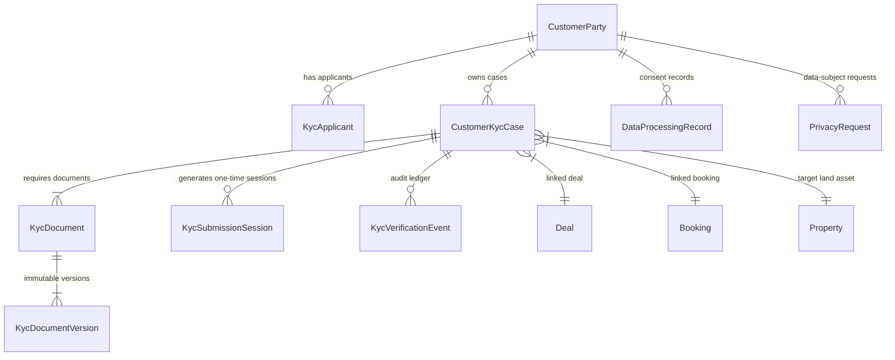
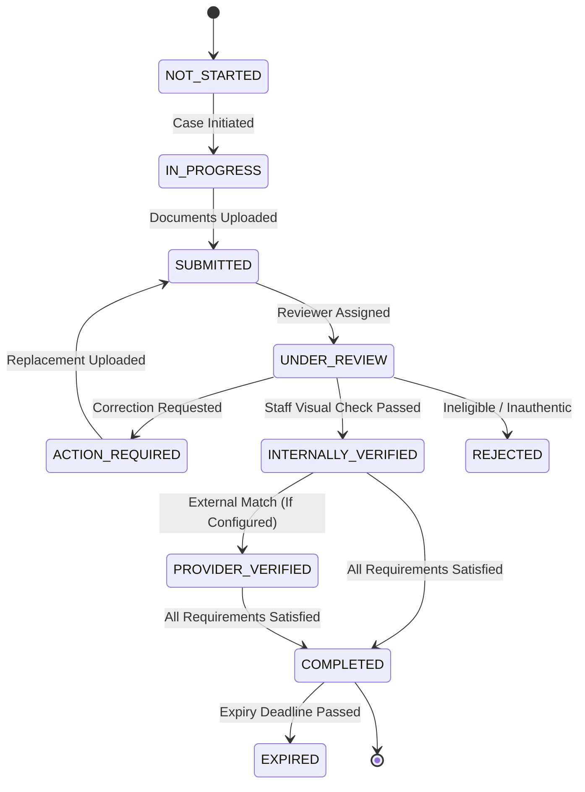

# Ratwal Dream Estates — PRD 15: Customer KYC, Identity Documents & Verification Workflow

## 1. Executive Summary & Legal Grounding

PRD 15 implements a privacy-first, legally grounded Customer KYC (Know Your Customer) and Identity Verification architecture for the **Ratiwal Dream Estates** luxury land-acquisition platform.

The implementation strictly satisfies:
- **Digital Personal Data Protection Act, 2023 (DPDPA)**: Purpose limitation, data minimization, explicit unbundled notice and consent recording, and statutory Data Principal rights management (Access, Correction, Erasure, Grievances).
- **UIDAI Aadhaar Offline Regulations**: No biometrics, no full plaintext 12-digit Aadhaar storage. Supports Paperless Offline e-KYC (XML with digital signature validation) and Masked Aadhaar (first 8 digits masked).
- **Indian Income Tax Act (PAN)**: Format validation, AES-256-GCM field encryption at rest, masked display (`ABCDE****F`), and server-side keyed HMACs for blind duplicate detection.
- **Operational Integration**: Strict gating preventing operational booking confirmation from `RESERVED` to `SOLD` if mandatory KYC is incomplete, recording the verified KYC version.

---

## 2. System Architecture & Entity Models



### Key Models

1. **`CustomerParty`** (`src/models/CustomerParty.ts`):
   - Master buying entity linking Leads, Deals, and Bookings.
   - Supported Party Types: `INDIVIDUAL`, `JOINT_APPLICANTS`, `COMPANY`, `PARTNERSHIP`, `TRUST`, `HUF`.

2. **`KycApplicant`** (`src/models/KycApplicant.ts`):
   - Applicant profile representing Primary or Joint buyers, Signatories, Guardians, or Beneficial Owners.
   - Application-level AES-256-GCM encryption for protected PII (`encryptedPan`, `encryptedAadhaarNumber`, `encryptedDob`, `encryptedAddressLine`).
   - Blind indexes using keyed HMAC-SHA256 (`panHmac`, `aadhaarHmac`) with pepper key stored outside MongoDB.

3. **`CustomerKycCase`** (`src/models/CustomerKycCase.ts`):
   - Central state machine (`RDE-KYC-XXXXXX`) binding Party, Property, Unit, Deal, Booking, and Template.
   - Deterministic risk flags (never AI-generated) and requirement counts.

4. **`KycRequirementTemplate`** (`src/models/KycRequirementTemplate.ts`):
   - Versioned requirement specifications:
     - `INDIVIDUAL_RESIDENTIAL`: PAN, ID Proof, Address Proof, Passport Photo.
     - `JOINT_RESIDENTIAL`: Primary & Co-Applicant PAN + Identity Proofs.
     - `NRI_INVESTOR`: Indian PAN, International Passport / OCI, NRE/NRO Bank Account Proof.
     - `COMMERCIAL_ENTITY`: Company PAN, Certificate of Incorporation, Board Resolution, Authorized Signatory ID.

5. **`KycDocument` & `KycDocumentVersion`** (`src/models/KycDocument.ts`, `src/models/KycDocumentVersion.ts`):
   - Append-only immutable version ledger with SHA-256 checksums, magic-byte MIME detection, and malware quarantine states.
   - Version replacement automatically invalidates prior verification and resets status to `UPLOADED`.

6. **`KycSubmissionSession`** (`src/models/KycSubmissionSession.ts`):
   - Single-purpose, 72-hour time-bound sessions.
   - Raw tokens are cryptographically generated (32-byte hex) and stored strictly as SHA-256 hashes.

7. **`DataProcessingRecord`** (`src/models/DataProcessingRecord.ts`):
   - Records DPDPA notice version, specific purpose, unbundled affirmative consent checkbox timestamps, and withdrawal logs.

8. **`KycVerificationEvent`** (`src/models/KycVerificationEvent.ts`):
   - Immutable audit trail tracking every verification step: `INTERNAL_VISUAL_REVIEW`, `DOCUMENT_MATCH`, `FORMAT_CHECK`, `UIDAI_OFFLINE_SIGNATURE`, `AUTHORIZED_PROVIDER`, `EXPIRY_REVIEW`, `MANUAL_OVERRIDE`.

9. **`PrivacyRequest`** (`src/models/PrivacyRequest.ts`):
   - Data Principal rights governance: `ACCESS`, `CORRECTION`, `UPDATE`, `ERASURE`, `CONSENT_WITHDRAWAL`, `GRIEVANCE`.
   - Statutory 30-day target turnaround and legal exception documentation.

10. **`KycRetentionPolicy`** (`src/models/KycRetentionPolicy.ts`):
    - Configurable statutory retention schedules (e.g., 8-year PMLA Section 12 for transacting buyers, 6 months for unfulfilled leads).
    - Immutable legal holds preventing automated purging.

---

## 3. KYC Lifecycle State Machine



---

## 4. Privacy & Regulatory Safeguards

### Aadhaar Safeguards
- **No Online Biometric / OTP Auth**: Real estate entities without formal KUA/AUA accreditation cannot access direct online authentication APIs.
- **Paperless Offline e-KYC & Masked Aadhaar**: Supported as optional identity proofs.
- **Storage Minimization**: Only the last 4 digits are displayed (`XXXX-XXXX-1234`). Full numbers are encrypted at rest with AES-256-GCM.
- **Blind Duplicate Indexing**: Keyed HMAC-SHA256 with external server pepper.

### PAN Safeguards
- **Strict Format Regex**: `^[A-Z]{5}[0-9]{4}[A-Z]{1}$`.
- **Masked Display**: `ABCDE****F`.
- **Verification Separation**: Format check is separated from internal inspection and authorized provider verification.

### Booking Confirmation Gate
In `BookingService.confirmBooking`:
```ts
const activeKycCase = await CustomerKycCase.findOne({
  $or: [{ dealId: deal._id }, { reservationId: reservation._id }],
});

if (activeKycCase && activeKycCase.blockingBookingConfirmation && activeKycCase.status !== "COMPLETED") {
  throw new Error(
    `KYC_INCOMPLETE: Customer KYC Case ${activeKycCase.kycCaseNumber} is currently in status "${activeKycCase.status}". Mandatory KYC must be completed prior to booking confirmation.`
  );
}
```

---

## 5. Customer Single-Purpose Upload Flow

1. Staff generates a 72-hour one-time link from the KYC Workspace (`/dashboard/kyc/cases/[caseId]`).
2. The server creates a cryptographically secure token, hashes it with SHA-256, and returns the one-time link `/kyc/submit/[token]`.
3. The customer opens the link:
   - Reads the DPDPA Purpose Notice.
   - Checks the explicit unbundled consent box.
   - Uploads requested document types (PDF/JPEG/PNG up to 25 MB).
   - Receives instant confirmation.
4. The token expires after 72 hours or 15 upload attempts, preventing unauthorized reuse.

---

## 6. Access Control & RBAC Permissions

| Role | KYC View | Initiate Case | Review Docs | Verify & Approve | Manage Policy & Holds | Privacy Requests |
| :--- | :---: | :---: | :---: | :---: | :---: | :---: |
| **Super Admin** | Full | Full | Full | Full | Full | Full |
| **Compliance / KYC Manager** | Full | Full | Full | Full | View / Review | Full |
| **Sales Manager** | Assigned | Permitted Deals | Read-Only | No | No | No |
| **Property Advisor** | Assigned | Request Link | No | No | No | No |

---

## 7. Operational & Deployment Checklist

- [x] Configure `KYC_ENCRYPTION_KEY` and `KYC_HMAC_SECRET` in environment variables outside MongoDB.
- [x] Seed default requirement templates: `INDIVIDUAL_RESIDENTIAL`, `JOINT_RESIDENTIAL`, `NRI_INVESTOR`, `COMMERCIAL_ENTITY`.
- [x] Seed statutory retention policies and DPDPA notice version `DPDPA_KYC_NOTICE_V1_2026`.
- [x] Integrate KYC completion gate with `BookingService.confirmBooking`.
- [x] Run automated test suite: `npx tsx --conditions=react-server scripts/test-kyc.ts`.
- [x] Execute clean production build: `npm run build`.
